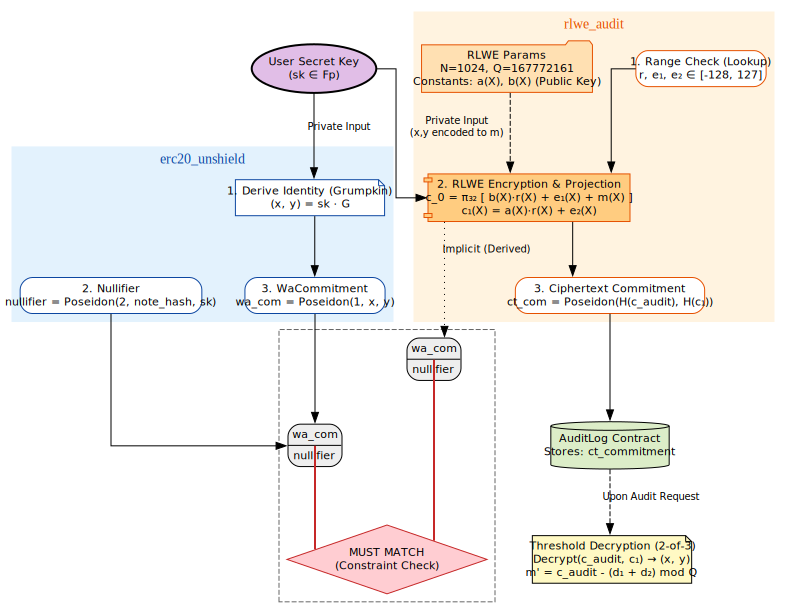

# LatticA: Auditable Dark Pool

LatticA is a privacy-preserving payroll and transaction system built on an auditable dark pool. It is a fork of [nemi-fi/mezcal](https://github.com/nemi-fi/mezcal), enhanced with an **RLWE-based audit module** to meet regulatory compliance requirements without sacrificing user privacy.

## Overview

Traditional ZK-based dark pools often use `Hash(sk)` as a user address. While efficient, this approach prevents identity proofing or encrypted communication. LatticA introduces a dual-structure proof system:
1. **Grumpkin Curve Integration**: Replaced simple hashes with `(x, y) = sk · G` coordinates, enabling public-key-based encryption.
2. **RLWE Encryption**: Implements Ring-LWE encryption for audit logs, allowing for **2-of-3 Threshold Decryption**. This ensures that no single entity can deanonymize users; at least two authorized auditors must cooperate to reveal an identity.



## Technical Specifications

### RLWE Audit Parameters
| Parameter | Value | Description |
|-----------|-------|-------------|
| N | 1024 | Polynomial degree |
| Q | 167772161 | Prime modulus |
| Delta | Q/256 | Message scaling factor |
| Noise | ±3 | Error distribution for security |
| Slots | 32 | Message slots (8-bit each) |
| Ciphertext | 1056 Fields | Structured as 32 $c_0$ + 1024 $c_1$ |

### Optimization
To overcome the computational overhead of RLWE within ZK circuits, we optimized the process by treating RLWE encryption as a matrix-vector multiplication. By embedding the public key as a **constant** within the Noir circuit and utilizing linear combinations, we significantly reduced gas costs and proof generation time.

## Performance Benchmark

| Stage | Execution Time | Memory Usage (RSS) |
|-------|----------------|--------------------|
| Circuit Load (10.13 MB) | 40.36 ms | 1.08 GB |
| UltraHonk Initialization | 305.29 ms | 1.14 GB |
| Witness Generation | 1.46 s | 1.33 GB |
| **Proof Generation** | **13.17 s** | **3.14 GB** |

## Quick Start

### Installation & Compilation
```bash
# Install dependencies
pnpm install

# Compile smart contracts
pnpm compile

# Initialize RLWE system (Generates audit keypair)
cd packages/contracts && pnpm rlwe:init

# Compile Noir circuits
cd packages/contracts/noir && nargo compile
```

### Execution
```bash
# Run RLWE standalone demo
pnpm demo:rlwe

# Run LatticA scenario (Shield → Transfer → Unshield → Audit)
pnpm demo:full-scenario

# Run performance benchmarks
pnpm benchmark:rlwe
```

## Frontend Demo

To test the full end-to-end scenario (Shield, Transfer, Unshield, and Audit Query) via the web interface:

### Start Local Node
```bash
cd packages/contracts
pnpm hardhat node
```

### Deploy Contracts
```bash
cd packages/contracts
pnpm deploy:localhost
```

### Launch Interface
```bash
cd apps/interface
pnpm dev
```

Access the UI at `http://localhost:5173`.

### MetaMask Setup
- **Network**: Localhost 8545 (Chain ID: 31337)
- **Import Hardhat Test Account**: `0xac0974bec39a17e36ba4a6b4d238ff944bacb478cbed5efcae784d7bf4f2ff80`

## Key Management

The audit system requires secure management of the RLWE secret key shares.

```bash
# Generate keys with a specific seed for reproducibility
pnpm rlwe:init --seed="company-audit-2026"

# Split secret key into shares for auditors
pnpm rlwe:init --share-secret
```

- `pk.nr`: Public key compiled into the circuit.
- `.rlwe_secret_key.json`: Secret key used for decryption (Keep Offline).

## Noir Circuits

| Circuit | Description |
|---------|-------------|
| `rlwe` | Core Ring-LWE encryption library |
| `rlwe_audit` | Proves identity (Baby JubJub PK) is correctly encrypted via RLWE |
| `rlwe_fraud_proof` | Verifies inconsistencies in audit entries |
| `rollup` | Handles batch processing of shielded transactions |

## Technology Stack

Noir, Solidity, Hardhat, Ethers.js, TypeScript, SvelteKit, pnpm

**ZK**: Noir 1.0.0-beta.5, Barretenberg, Poseidon, Baby JubJub (Grumpkin), RLWE  
**Contracts**: Solidity, Hardhat 2.22.16, OpenZeppelin, TypeChain  
**Frontend**: SvelteKit 2.7.2, Svelte 5.0.5, Vite, Tailwind CSS  
**Testing**: Chai, Vitest, Hardhat Gas Reporter

## Contract Addresses

### Mantle Sepolia (Chain ID: 5003)

| Contract | Address |
|----------|---------|
| PoolERC20 | `0x8554023e95557A47cdCBCDf3f7002b1d2924d9cD` |
| RollupVerifier | `0x1cDa73DacD45eef50C689143E4eEf2aaE6b66296` |
| Erc20ShieldVerifier | `0xE2C034a8475e3e08E044C7090C2D547c54b6C5c1` |
| Erc20UnshieldVerifier | `0x14DFf1BA04DCbEA5B84658b228bA74ae8183F829` |
| Erc20TransferVerifier | `0x28E89D046abf0Db583d58A5B0Ac12a9B0222476a` |
| Erc20JoinVerifier | `0xe40fEFfa9B5CaE95ceDA2ba35f89B8e4485CD269` |
| LobRouterSwapVerifier | `0x311e84a311A2de8f977AaC77D93B6c8B6c420EbB` |
| MockUSDC | `0xBbd207660362fad3DB0f1dEcccfA1fF20BdF878B` |
| MockBTC | `0x827e88CEae659e6777Aa57F68FA7a2CbE6012de4` |

## License

This project is a fork of Mezcal. See the original repository for licensing details.
